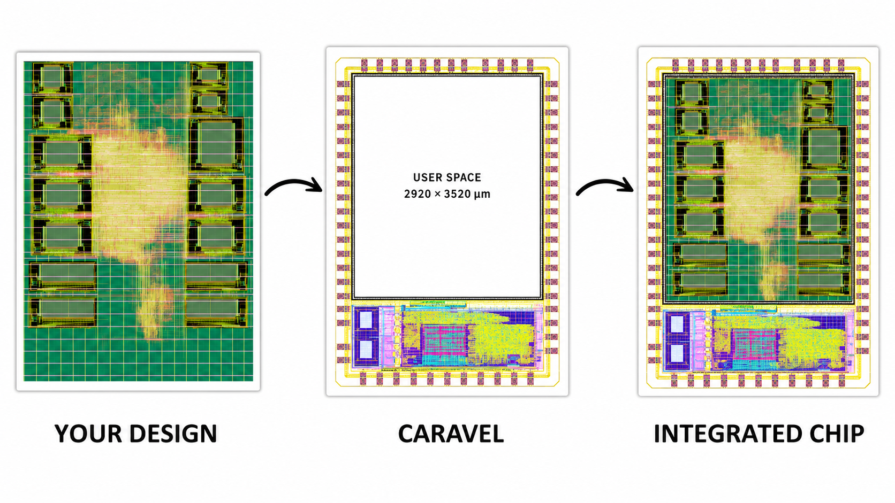

# 30 Days of ASIC Physical Design

I will analyze each step of the PnR flow in depth. The design will be implemented within the Caravel project framework.

*Figure 1 — Caravel/Kyber integration overview.*

## The 30-topics roadmap

| Day | Topic | Practical focus |
|---:|---|---|
| 01 | [Physical Design Overview](topics/01-physical-design-overview/README.md) | Stage inputs, outputs, feedback loops |
| 02 | [Netlist & Standard Cells](topics/02-netlist-standard-cells/README.md) | Verilog, Liberty, LEF, GDS views |
| 03 | PDK Fundamentals | Layers, vias, rules, corners |
| 04 | Timing Fundamentals | Arrival, required time, setup/hold slack |
| 05 | STA Basics | Path types, timing graphs, reports |
| 06 | Clock & Constraints | SDC clocks, I/O delays, uncertainty |
| 07 | Synthesis → PD Handoff | Deliverables and interface checks |
| 08 | Floorplanning | Die, core, aspect ratio, utilization |
| 09 | Macro Placement | Halos, channels, macro pin access |
| 10 | I/O Placement | Pin sides, ordering, feedthroughs |
| 11 | Power Planning | Rails, straps, rings, macro connections |
| 12 | PDN Analysis | IR drop, current density, EM |
| 13 | Placement | Global placement and legalization |
| 14 | Placement Optimization | Resize, buffer, repair, legalize |
| 15 | Congestion Analysis | Demand, capacity, overflow, density |
| 16 | Pre-CTS Timing | Setup repair with an ideal clock |
| 17 | Clock Tree Synthesis | Buffer topology, sinks, NDR concepts |
| 18 | CTS Analysis | Latency, local/global skew, transition |
| 19 | Post-CTS Optimization | Propagated-clock setup/hold repair |
| 20 | Routing | Guides, tracks, vias, detailed route |
| 21 | Routing DRC | Shorts, spacing, enclosure, min area |
| 22 | Post-Route STA | SPEF annotation and extracted timing |
| 23 | Setup Closure | Sizing, buffering, Vt and path strategy |
| 24 | Hold Closure | Delay insertion, skew, route detours |
| 25 | Crosstalk / Signal Integrity | Coupling, aggressors, noise and delta delay |
| 26 | Physical Verification | DRC, LVS, connectivity methodology |
| 27 | Antenna & Density | Diodes, layer hopping, metal fill |
| 28 | Signoff | Evidence matrix and tapeout checklist |
| 29 | Full OpenROAD Flow | Preserved run, runtime, stages, failures |
| 30 | Final Analysis | PPA, timing, routing and next actions |