# Topic 01 — Physical Design Overview

## Agenda

| Order | Content | Description | Objectives |
|---|---|---|---|
| 1 | [Digital Background and CMOS process](#1-digital-background-and-cmos-process) | • Overview of knowledge for Digital Design. • Physical Structure and Fabrication Overview | • Grasp fundamental digital design concepts. • Understand the IC fabrication flow and CMOS structures.
| 2 | [Input of PnR flow](#inputs-of-pnr-flow) | Netlist, Constraint (SDC), Physical Library File (.lib), UPF, DEF | Identify the input, output, optimization goal, and feedback loop of each stage.
| 3 | Digital Design and PnR flow | • Floorplan (Initializaion)   • Placement (PreCTS)   • Clock Tree Synthesis (PostCTS)   • Routing   • Timing Closure   • Physical Verification and Signoff | • Place every implementation stage in the RTL-to-GDS flow   • Distinguish a generated GDS from a signoff-qualified layout
|
 
### 1. Digital Background and CMOS process

| | |
|:---|:---|
| **Digital Circuits**   ▪ Combinational Logic: AND, OR, INV ...   ▪ Sequential Logic: Flip-Flop, Latches ...    **Timing Concepts**   ▪ Clock drives sequential elements   ▪ Setup / Hold time define valid data window   ▪ Slack = Required time - Arrival time | **Design Abstraction**   ▪ RTL -> Behavioral description (Verilog/VHDL)   ▪ Gate-level Netlist -> Logic mapped to standard cells   ▪ Physical Layout -> Placement & Routing on silicon    **Standard Cell Library**   ▪ Building blocks: INV, NAND, NOR, DFF ...   ▪ Characterized for timing, power, area   ▪ Used during synthesis & PnR |

**CMOS Inverter — Physical Structure and Layout**

  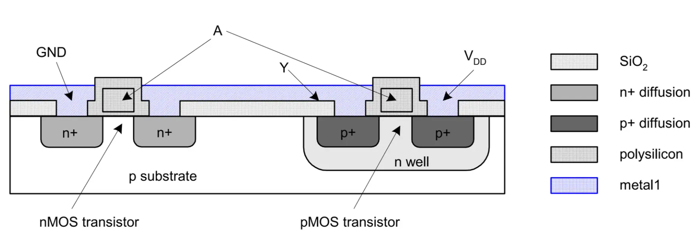

  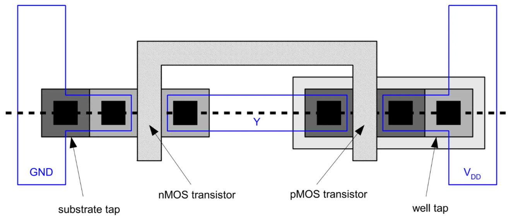

A CMOS inverter consists of an **nMOS transistor** formed in the p-substrate and a **pMOS transistor** formed inside an n-well.

- The gates of both transistors are connected together to form the input **A**.
- Their drains are connected together to form the output **Y**.
- The nMOS source is connected to **GND**, while the pMOS source is connected to **VDD**.
- **Substrate tap** and **well tap** provide proper body connections to GND and VDD.
- The physical layout represents these devices using diffusion, polysilicon, contacts, wells, and metal interconnect layers.

### CMOS Fabrication Overview

  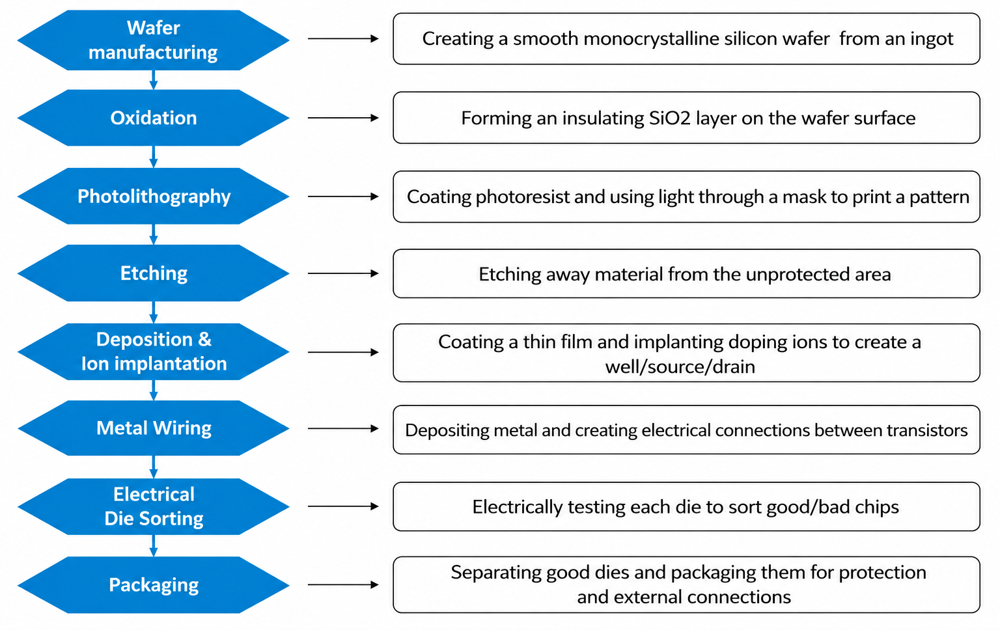

## 2. Inputs of PnR flow

  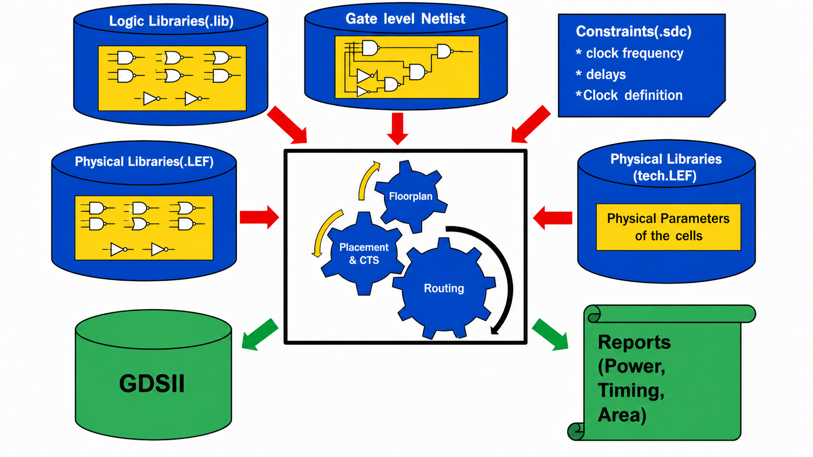

| Input files | Basic Information | Provided by | Used in which step
|---|---|---|---|
| **Netlist (.v, .vhd)** | Describe the circuit in form of a gate-level netlist, connections between cells (nets, ports) | Synthesis Tools (DC, Genus, Yosys) | Floorplan Stage |
| **Constraints (.sdc)** | Timing constraint, definition of clock, input/output delay, false/multicycle path, case analysis | Frontend teams (RTL, Synthesis) and STA team | Synthesis, STA, Placement
| **Cell LEF (.lef)** | Cell width, height; Pin place, layer (metal, via), obstruction/blockage | Library vendor or IP team | Floorplan, Placement, CTS, Routing |
| **Technology LEF (.techlef)** | Technology information: routing layers, vias, layer direction, pitch, width, spacing, site and basic design rules | Foundry / PDK vendor | Floorplan, Placement, CTS, Routing |
| **Timing Library (.lib)** | Timing and power info. data for each cell: delay, setup, hold, slew, dynamic & leakage power | Library Vendor (e.g, Synopsys, ARM) | Synthesis, STA |
| **Unified Power Format (UPF)** | Power domains, power switches, isolation cells, retention cells, level shifters and power states | Power Architecture / Frontend (RTL) team | During PnR flow |
| **Design Exchange Format (DEF)** | Describes actual cell, macro placement, net connection, routing, chip size | Generated by tool | Floorplan, Placement, CTS, Routing |

## 3. Digital Design and PnR flow

*ASIC implementation stages and feedback context. Source: [OpenLane 2 documentation asset](https://github.com/efabless/openlane2/blob/main/docs/source/getting_started/newcomers/asic-flow-diagram.webp), Apache-2.0.*

  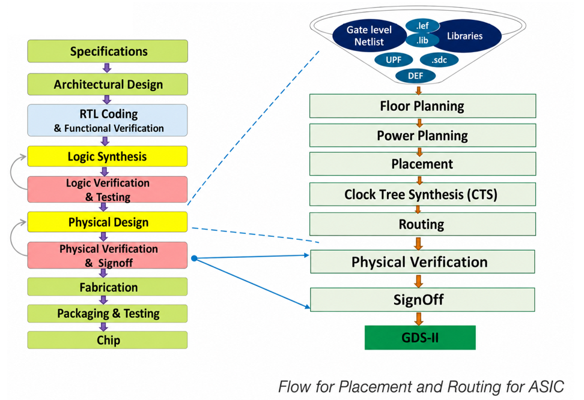

### 3.1. Floorplanning – Utilization Factor and Pre-placed
---
<table>
<tr>
<td width="50%" valign="top">

### Formula of UF:

$$
UF = \frac{\text{Standard cell area} + \text{Macro area}}
{\text{Total Area}} \times 100
$$

$$
\text{AR (Aspect Ratio)} = \text{Height / Width}
$$
---

### Pre-placed

**Pre-placed:** Special blocks that are fixed in position before tool does. Examples: SRAM, ROM, PLL, DSP, ...

**Purpose:** Fixed location for large macro or important cells to optimize timing and routing.

---

### Pin-Placement

**Pin here:** I/O port or block-level pin of the design. Determining the location of these pins around the boundary of the core/block.

</td>

<td width="50%" valign="top">

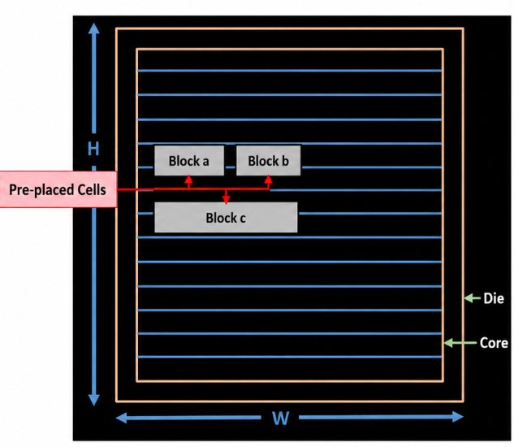

</td>
</tr>
</table>

### Powerplanning 
---
This is step of designing the power delivery network for the chip. Follow the step like below:

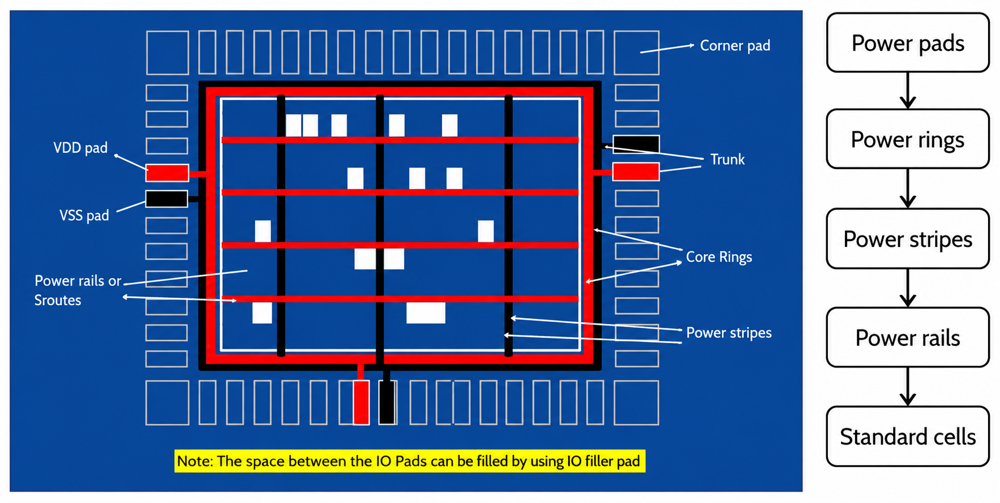

</td>
</tr>

**Purpose**: deliver VDD and VSS from IO pads to each standard cell & macro in the core in a sufficient, stable, and balance.

### 3.2. Placement (PreCTS)
---
<table>
<tr>
<td width="30%" valign="top">

### Global Placement:  
- Estimate the preliminary position for all the standard cell based connectivity. 
- Ignored grid details

**Purpose:** 
- Keep cells close together according to netlist to reduce wirelength. 
- Create uniform distribution.

</td>

<td width="70%" valign="top">

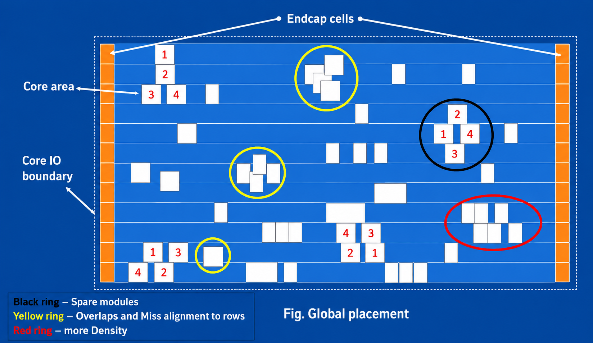

</td>
</tr>
</table>

---
<table>
<tr>
<td width="30%" valign="top">

### Legalization:  
- Covert cell position from global placement to valid coodinates on rows.

- Solves the following cases:
     - Cell is overlapping.
     - Cell is not on the grid.
     - Cell overflows outside the core area

**Purpose:** 
- Make the design legal before optimization

</td>

<td width="70%" valign="top">

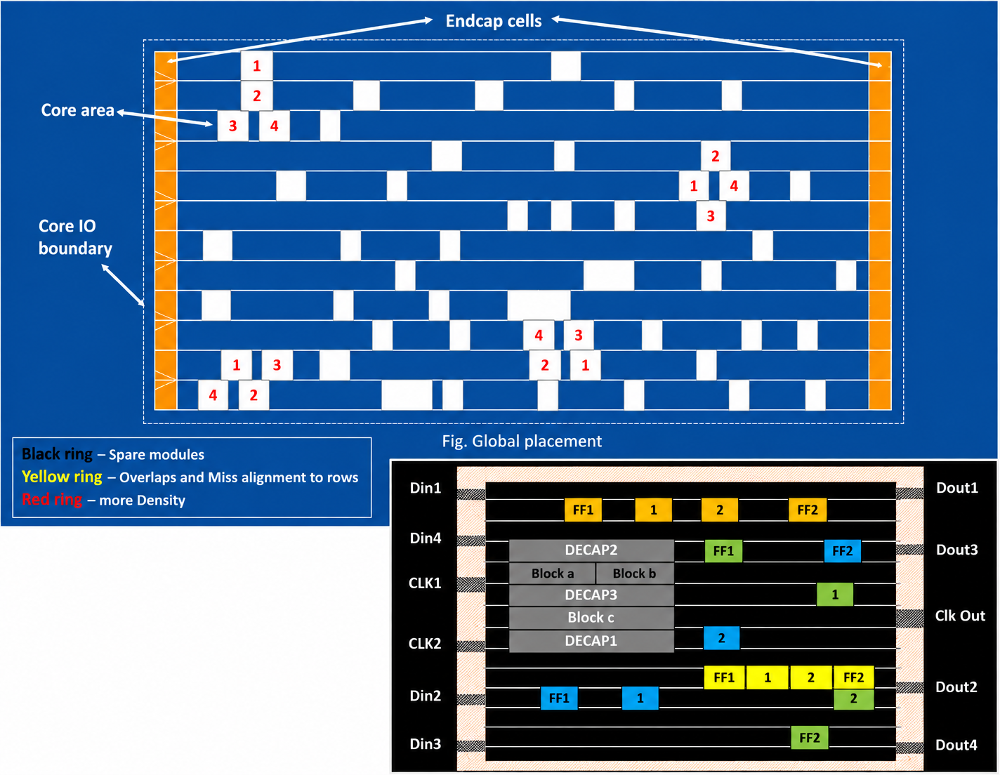

</td>
</tr>
</table>

---
<table>
<tr>
<td width="30%" valign="top">

### Optimizing placement continued: 
- Add buffer, upsizing/downsizing cells.
- Re-placement some cells.
- Reduce the number of nets running through overloaded areas.
- Move cells to reduce switching power.

**Purpose:** 
- Improve setup timing before CTS.
- Make routing easier.
- Reduce dynamic power by limiting wirelength

</td>

<td width="70%" valign="top">

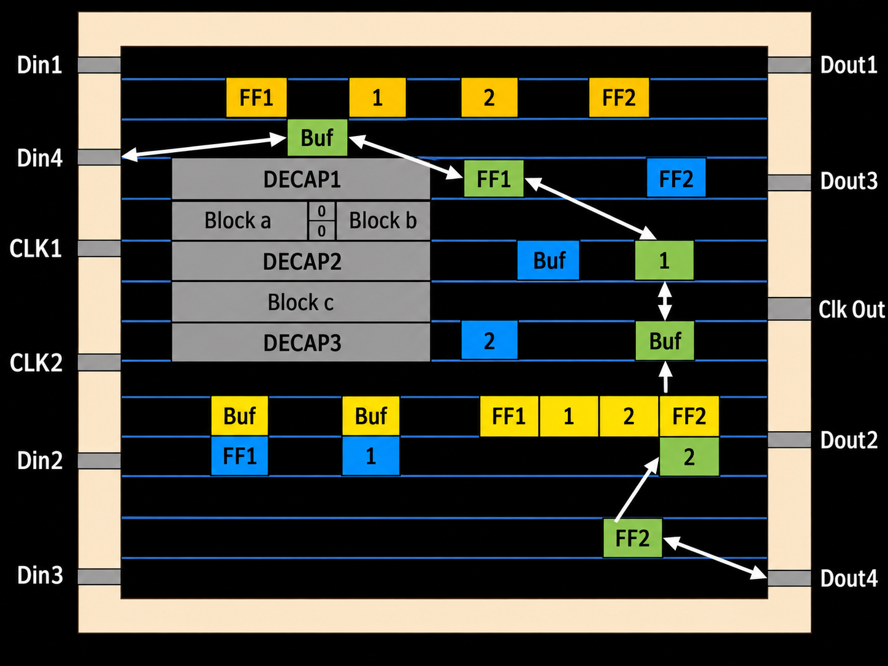

</td>
</tr>
</table>

### 3.3. Clock Tree Synthesis (CTS)
---
### Define: 
CTS is a step in PnR flow used to build the clock distribution network from the clock source (PLL, clock pin) to all sequential elements (flip-flop, latch).

### Follow the order below:

<table>
<tr>

<td width="50%" valign="top">

- **Choose topology based on:**
  - Skew target
  - Insertion delay target
  - Power and performance trade-off

- **Insert clock buffer/inverter cells from library**

- **Check to ensure timing rules (Post-CTS timing analysis)**
  - Ensure setup time
  - Ensure hold time
</td>
<td width="50%" valign="middle">
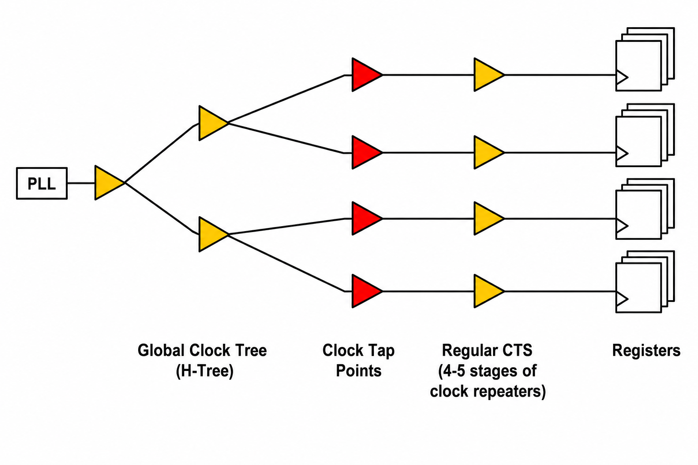
</td>
</tr>
</table>

---
<table>
<tr>

<td width="50%" valign="top">

Result after completing **clock tree planning**, choosing topology (ex. with H-tree)  
**Purpose:** select appropriate topology and optimize the line to reduce latency

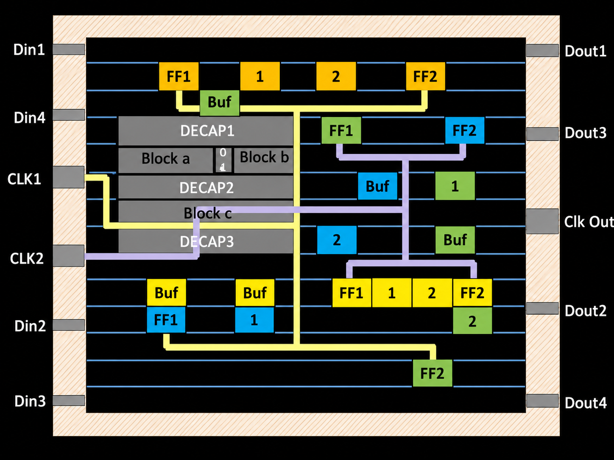
</td>
<td width="50%" valign="top">

Result after **inserting buffer/inverter** and adjust the number of those; balance the skew between branches  
**Purpose:** Reduce fanout; Keep slew within limits; Balance branch lag.

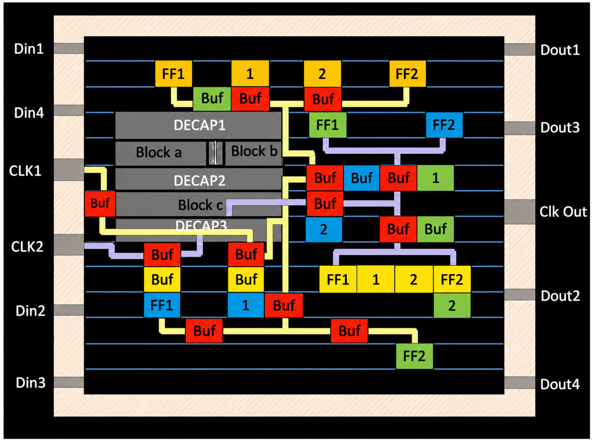
</td>
</tr>
</table>

---
### Types of Clock Tree Structure
<table>
<tr>

<td width="50%" valign="top">

**H-tree clock structure**

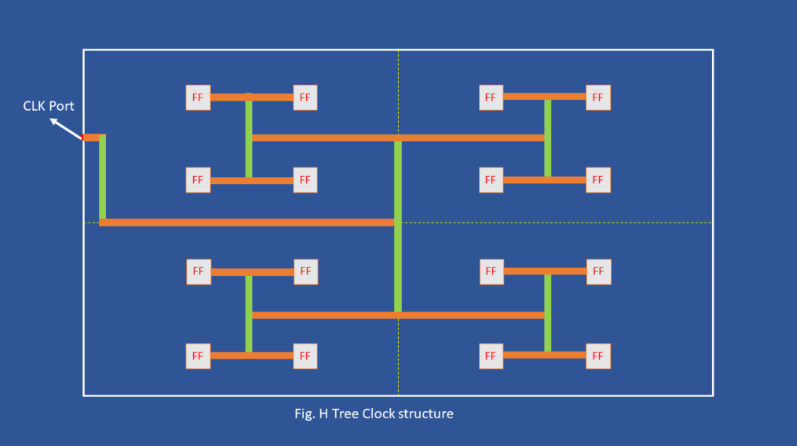
**Geometric Matching Algorithm structure**

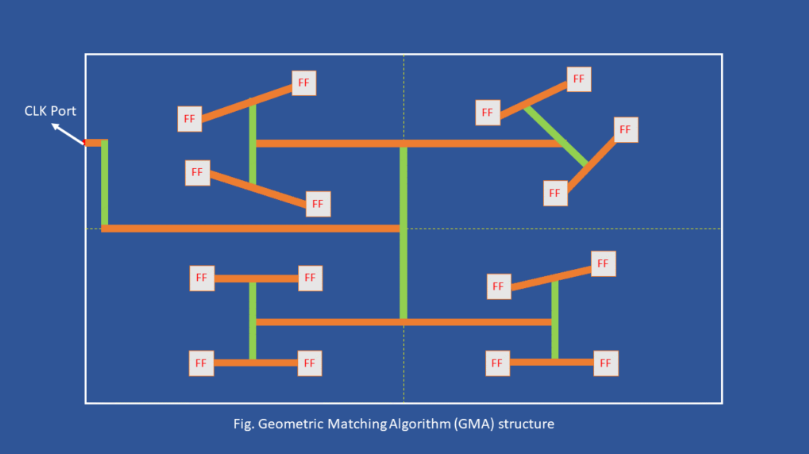
</td>
<td width="50%" valign="top">

**X-tree clock structure** 

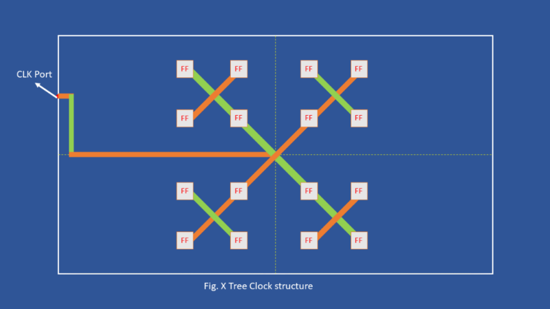
**Fish bone clock structure, etc.**

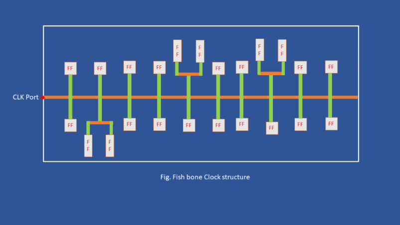
</td>
</tr>
</table>

---